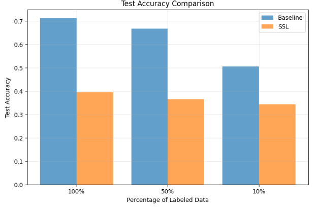
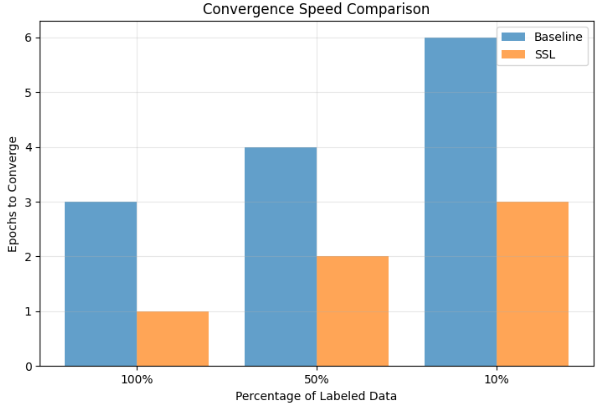
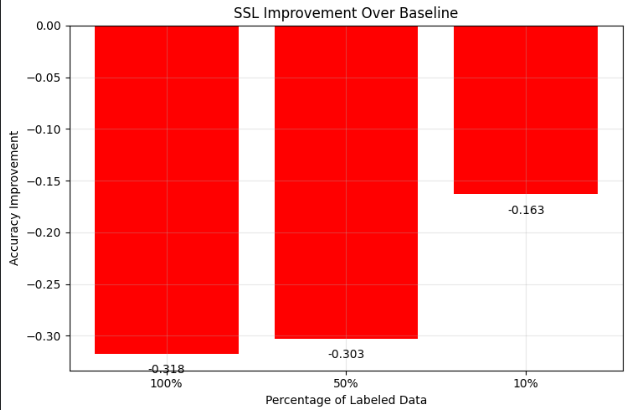
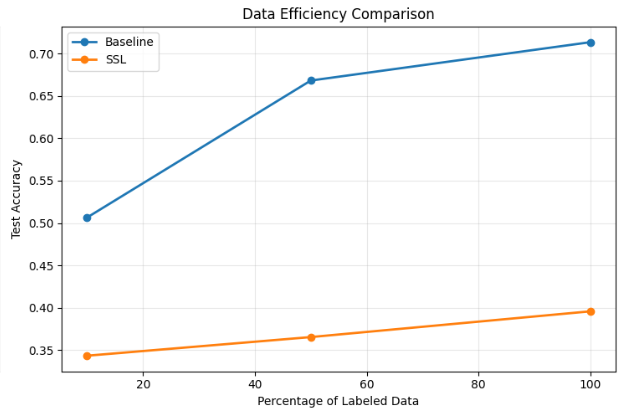
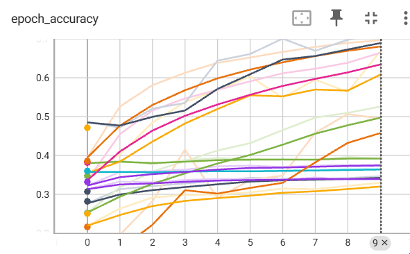
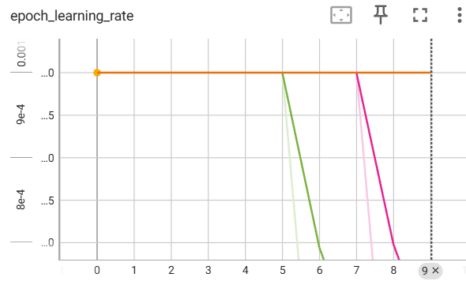
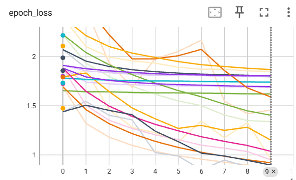

# Self-Supervised Learning on CIFAR-10 Dataset

## Project Overview

This project explores self-supervised learning (SSL) techniques on the CIFAR-10 dataset, comparing SSL-pretrained models against supervised baselines across different data regimes.

---

### Task Description

Based on Homework 1, this project implements self-supervised learning with the following experimental setup:

- **Baseline**: Repeat Homework 1 using N% of labeled samples (N = 100, 50, 10)
- **SSL Approach**:
  1. Pretrain the feature extractor on the entire dataset using self-supervised learning without labels
  2. Use the pretrained feature extractor in the network architecture for training on N% of labeled samples
  3. Compare performance against baseline models

### Dataset
- **CIFAR-10**: 60,000 32x32 color images across 10 classes
- Training set: 50,000 images
- Test set: 10,000 images

### Architecture
- Feature extractor pretrained using self-supervised learning
- Same architecture used for both SSL and baseline for fair comparison
- Evaluation on standard classification metrics

### Training Configuration
- Multiple data regimes: 100%, 50%, 10% of labeled data
- Consistent hyperparameters across experiments
- Early stopping based on convergence criteria

### Analysis Dimensions

- Training loss convergence patterns
- Metric evolution during training
- Convergence speed (epochs to plateau)
- Maximum achieved performance metrics

## Experimental Results

### Performance Metrics Comparison

| Experiment | Accuracy | Precision | Recall | F1-Score | Convergence Epochs |
|------------|----------|-----------|--------|-----------|-------------------|
| **SSL N=100%** | 0.3958 | 0.3893 | 0.3958 | 0.3871 | 1 |
| **Baseline N=100%** | 0.7135 | 0.7226 | 0.7135 | 0.7066 | 3 |
| **SSL N=50%** | 0.3654 | 0.3648 | 0.3654 | 0.3602 | 2 |
| **Baseline N=50%** | 0.6682 | 0.6801 | 0.6682 | 0.6566 | 4 |
| **SSL N=10%** | 0.3434 | 0.3366 | 0.3434 | 0.3376 | 3 |
| **Baseline N=10%** | 0.5065 | 0.5118 | 0.5065 | 0.4900 | 6 |

### Performance Summary

| Model | Best Accuracy | Best Precision | Best Recall | Best F1-Score | Data Regime |
|-------|---------------|----------------|-------------|---------------|-------------|
| **SSL** | 0.3958 | 0.3893 | 0.3958 | 0.3871 | N=100% |
| **Baseline** | 0.7135 | 0.7226 | 0.7135 | 0.7066 | N=100% |

## Key Findings

### Convergence Analysis
- **SSL models** consistently reached convergence faster across all data regimes
- **Baseline models** required more epochs to plateau, especially in low-data regimes
- Convergence advantage: SSL models converged 2-3x faster than baseline

### Performance Analysis

OVERALL IMPROVEMENT ANALYSIS:
- N=100%: SSL -0.3177 (-44.5%) improvement
- N=50%: SSL -0.3028 (-45.3%) improvement
- N=10%: SSL -0.1631 (-32.2%) improvement

### Trade-off Observations
- **Speed vs Accuracy**: SSL provides faster convergence but lower final accuracy
- **Data Efficiency**: The performance gap narrows in extremely low-data regimes (N=10%)
- **Optimal Use Case**: SSL may be preferable when training time is critical and moderate accuracy is acceptable

## Conclusion

The experiments demonstrate that self-supervised learning provides significant advantages in convergence speed but trades off against final model accuracy. The SSL approach shows particular promise in low-data scenarios where the performance gap is smallest relative to the convergence benefits.

---

## Требования
Установка зависимостей:
pip install -r requirements.txt
