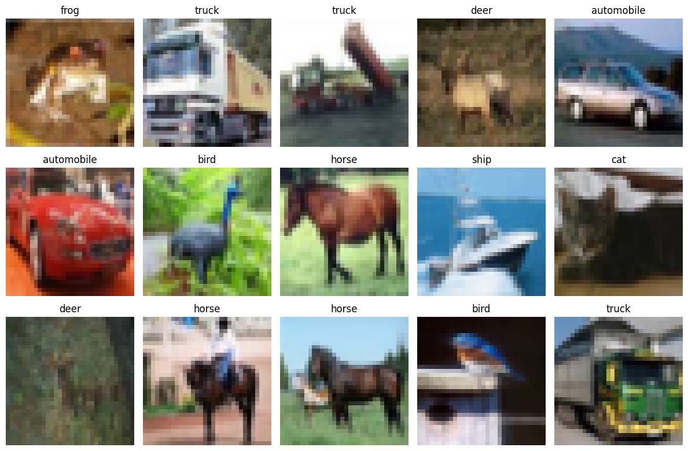

# Классификация изображений CIFAR-10 с использованием EfficientNetB0 + TensorBoard

## 🧩 1. Описание задачи
Этот проект решает задачу классификации изображений с использованием глубокой сверточной нейронной сети (EfficientNetB0).
Основные цели:
- Обучить модель для классификации 10 категорий объектов из набора данных CIFAR-10.
- Визуализировать производительность обучения (потери, точность) в TensorBoard.
- Оценить точность (precision), полноту (recall) и F1-меру для каждого класса.
- Дообучить предварительно обученную модель EfficientNet для повышения точности.

**Реализованные задачи**
- Загрузка данных, визуализация и предварительная обработка (нормализация, one-hot кодирование).
- Создание модели с использованием трансферного обучения.
- Обучение модели в два этапа:  
  1️⃣ Обучение с замороженной базовой моделью  
  2️⃣ Тонкая настройка выбранных слоев  
- Отслеживание экспериментов с TensorBoard (кривые потерь и точности).
- Оценка модели и визуализация метрик (матрица ошибок, метрики по классам).

---

## 🗂️ 2. Описание набора данных

**Набор данных:** [CIFAR-10](https://www.cs.toronto.edu/~kriz/cifar.html)

<!-- Image in the same directory -->

**Composition:**
- **Всего изображений:** 60,000  
  - 50,000 для обучения
  - 10,000 для тестирования
- **Классы (10 категорий):**
  - airplane, automobile, bird, cat, deer, dog, frog, horse, ship, truck
- **Размер изображений:** 32x32 пикселя, RGB (3 канала)

---

## 🧠 3. Результаты обучения и эксперименты

**Model:** EfficientNetB0 (pretrained on ImageNet, fine-tuned on CIFAR-10)

### Настройки обучения
- Optimizer: `Adam`
- Loss: `categorical_crossentropy`
- Epochs: 10
- Batch sizes: 64 (stage 1), 32 (stage 2)
- Callbacks:
  - EarlyStopping (patience=10)
  - ReduceLROnPlateau
  - TensorBoard (for logging)

### Experiment Results
| Метрика | Значение |
|--------:|:------|
| Final Test Accuracy | 0.3620 |
| Final Test Loss | 1.7113 |
| Precision  | 0.4692 |
| Recall  | 0.3620 |
| F1-Score | 0.3135 |

## 📊 Classification Report

| Class | Precision | Recall | F1-Score |
|-------|-----------|--------|----------|
| airplane | 0.6792 | 0.0720 | 0.1302 |
| automobile | 0.5975 | 0.3400 | 0.4334 | 
| bird | 0.4654 | 0.0740 | 0.1277 | 
| cat | 0.2450 | 0.1470 | 0.1837 | 
| deer | 0.5116 | 0.0440 | 0.0810 | 
| dog | 0.3737 | 0.4630 | 0.4136 |
| frog | 0.2527 | 0.8870 | 0.3933 |
| horse | 0.7254 | 0.2510 | 0.3730 | 
| ship | 0.3547 | 0.8200 | 0.4952 |
| truck | 0.4865 | 0.5220 | 0.5036 |

## 📊 4. Visualizations
- Training/validation loss and accuracy curves (via TensorBoard)
- Confusion matrix
- Class-wise precision, recall, and F1 comparison
- Sample predictions with confidence scores

## Requirements
Install dependencies:
pip install -r requirements.txt
